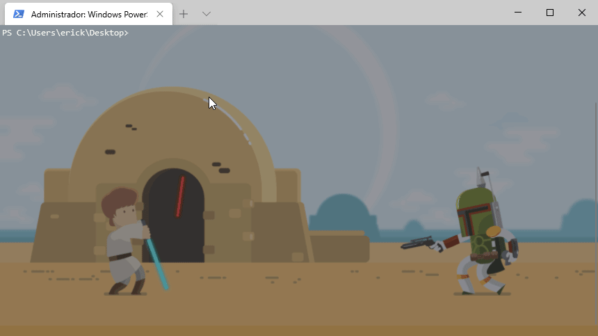
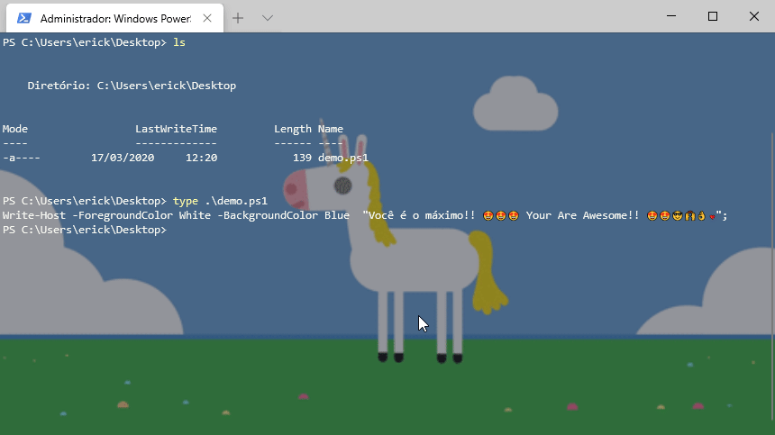

# Como personalizar

Utilizei os schema de cores do thema Dracula e apenas personalizei ao meu gosto.

**Copie e substitua** o arquivos da pasta `profile` no seguinte diretório que é onde ficam os arquivos de configuração do Windows Terminal:
>
>C:\Users\seuUsuário\AppData\Local\Packages\Microsoft.WindowsTerminal_8wekyb3d8bbwe\LocalState\
>
Você pode utilizar qualquer outra imagem, inclusive gifs, ligar ou desligar o efeito acrilico, ajustar opacidade de forma simples, tudo neste código.

Por padrão, deixei o tema em **default** para ser aplicado a todos os terminais que utilizo. Mas você pode personalizar um por um em suas propriedades, tendo assim variedades


## Atributos

**Efeito acrilico**

Abaixo um exemplo de como ativar e configurar intensidade do efeito acrilico com opacidade
```json
{   // Valor pode ser true ou false
    "useAcrylic" : true,
    // Valor ajustável para intensidade da opacidade
    "acrylicOpacity" : 0.85
}
```
**Background atributos**

Abaixo um exemplo de como selecionar o background, configurar o alinhamento e sua opacidade
```json
{
    // Caminho da imagem
   "backgroundImage" :  "ms-appdata:///local/starwars.gif",  
   "backgroundImageAlignment" : "bottomRight",
   // Opacidade do background
   "backgroundImageOpacity" : 0.50,
   "backgroundImageStretchMode" : "uniformToFill"
}
```
Para mais informações de configurações acesse 
[Editing Windows Terminal Json Settings - Microsoft Repository](https://github.com/microsoft/terminal/blob/master/doc/user-docs/UsingJsonSettings.md)
## How to configure

I used the color scheme of the Dracula theme and just customized it to my liking.

**Copy and replace** the contents of the `profile` directory into the Windows
Terminal application data folder.
>
>C:\Users\yourUser\AppData\Local\Packages\Microsoft.WindowsTerminal_8wekyb3d8bbwe\LocalState
>

You can use any other image, including gifs, turn the acrylic effect on or off, adjust the opacity in a simple way, all in this code.

By default, leave the theme by default to apply all terminals you use. But you can customize your properties one by one, thus having varieties.


## Attributes

**Acrylic effect**

Below is an example of how to activate and configure the intensity of the acrylic effect with opacity
```json
{
    // Value can be true or false
    "useAcrylic": true,
    // Adjustable value for opacity intensity
    "acrylicOpacity": 0.85
}
```
**Background attributes**

Below is an example of how to select the background, configure the alignment and its opacity
``` json
{
    // image path
   "backgroundImage": "ms-appdata: ///local/starwars.gif",
   "backgroundImageAlignment": "bottomRight",
   // Background opacity
   "backgroundImageOpacity": 0.50,
   "backgroundImageStretchMode": "uniformToFill"
}
```
For more information on configurations visit
[Editing Windows Terminal Json Settings - Microsoft Repository](https://github.com/microsoft/terminal/blob/master/doc/user-docs/UsingJsonSettings.md)

### Extras

Alguns gifs que você pode utilizar com este repositório, que já estão na pasta `profile` e eu gosto muito.

Some gifs that you can use with this repository, which are already in the `profile` folder and I really like it.

**Star Wars**


**Unicórnio**

